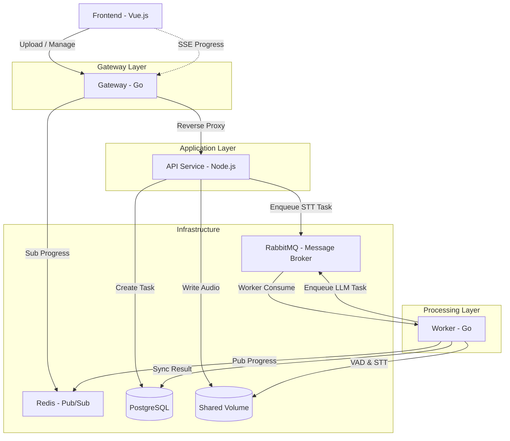

# STT-AI: Speech-to-Text Summarization System

這是一個高效、解耦的語音轉錄與 AI 摘要系統。採用微服務架構，結合 **Go (Gateway)**、**Node.js (API Service)** 與 **Go (Worker)**。透過 RabbitMQ 非同步處理任務，並使用 Redis SSE (Server-Sent Events) 技術實現即時進度推送。

## 🚀 快速啟動 (One-Click Start)

本專案已完全容器化，只需一行指令即可啟動完整開發環境。

### 1. 配置環境變數

首先，請將專案根目錄下的 `.env.example` 複製為 `.env`，並視需求修改 API Keys。

```bash
cp .env.example .env
```

- **MOCK=true** (預設): 使用模擬 API，無需設定任何 Key 即可測試流程。
- **MOCK=false**: 請務必填寫 `AI_STT_KEY` (Whisper) 與 `AI_LLM_KEY` (Gemini/OpenAI)。

### 2. 啟動服務

```bash
# 一鍵啟動所有組件
docker-compose up --build -d
```

### 3. 訪問系統

啟動後，開啟瀏覽器訪問：

- **前端介面**: [http://localhost:8090](http://localhost:8090)
- **RabbitMQ 管理後台**: [http://localhost:15673](http://localhost:15673) (guest/guest)
- **Nginx 反向代理**: [http://localhost:8090/api](http://localhost:8090/api) (指向 API 服務)

---

## 🛠 技術規格與架構

### 核心技術棧

- **Language**: Node.js (TypeScript), Go
- **Frontend**: Vue 3 (Composition API)
- **Database**: PostgreSQL (任務 SSOT)
- **Message Broker**: RabbitMQ (任務解耦與非同步處理)
- **Real-time**: SSE (via Redis Pub/Sub)
- **AI/ML**: OpenAI Whisper (STT), Gemini/OpenAI (LLM)

### 系統架構圖



---

## 📖 API 說明

### 任務管理系統

| Method     | Endpoint                 | Description                                |
| :--------- | :----------------------- | :----------------------------------------- |
| **POST**   | `/api/tasks`             | 初始化任務，獲取 `taskId`                  |
| **PUT**    | `/api/tasks/{id}/upload` | 串流上傳音檔 (最高支援 1GB)                |
| **GET**    | `/api/tasks/{id}`        | 查詢任務詳情 (原文與摘要)                  |
| **DELETE** | `/api/tasks/{id}`        | 取消進行中的任務                           |
| **GET**    | `/api/tasks/{id}/events` | **SSE 端點**: 訂閱、監聽即時進度與摘要串流 |

---

## ✨ 亮點功能 (加分項目實作)

1.  **即時串流摘要 (Streaming LLM)**: Worker 呼叫 LLM 時採用 SSE 串流模式，每產生一個字就透過 Redis Pub/Sub 推送到前端，讓用戶無需等待完整生成。
2.  **大檔案非阻塞上傳**: 使用 Node.js `stream.pipeline` 處理音檔上傳，不佔用伺服器內存，且任務直接進入背景 Queue 處理。
3.  **智能音檔切片 (VAD)**: Go Worker 內建語音偵測 (Voice Activity Detection)，在轉錄前自動在靜音段切割音檔，解決 Whisper 的 25MB 限制並保持語句通順。
4.  **解耦 Pipeline**: STT 轉錄與 LLM 摘要分為兩個獨立 Task。若 LLM 階段失敗，系統可直接重試摘要階段，無需重新支付轉錄昂貴的計算/ API 成本。
5.  **原子狀態管理**: 基於 PostgreSQL 事務與原子操作，確保任務狀態 (Pending -> Processing -> Completed) 的正確性與任務抵達保證。

---

## 📁 專案結構

```
stt-ai/
├── gateway/             # Go: SSE 管理、反向代理、連線回復
├── api-service/         # Node.js: 業務邏輯、串流上傳、任務調度
├── worker/              # Go: 音檔 VAD 切片、併發 STT、LLM 串流生成
├── webapp-vue/          # Vue 3: 互動介面 (SSE 渲染)
├── infrastructure/      # SQL 初始化、Nginx/Docker 配置
└── docker-compose.yml   # 系統編排
```
