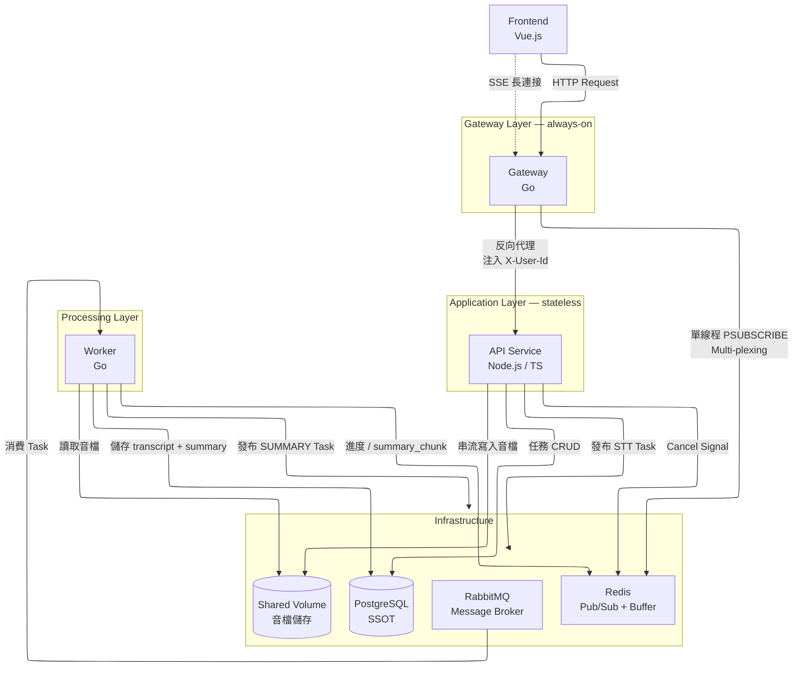
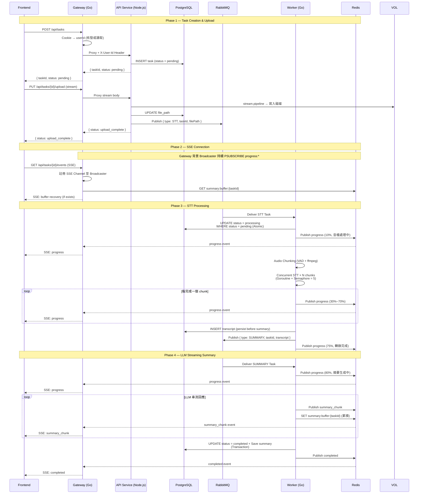
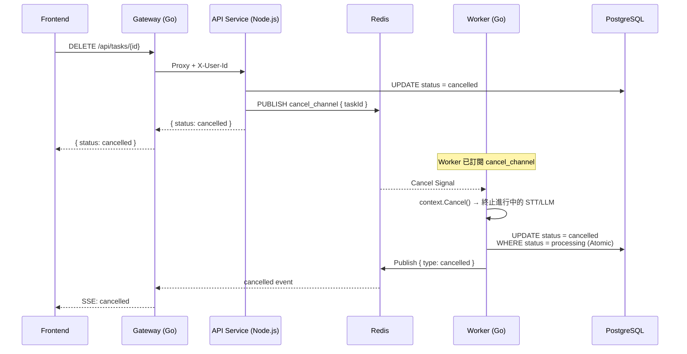
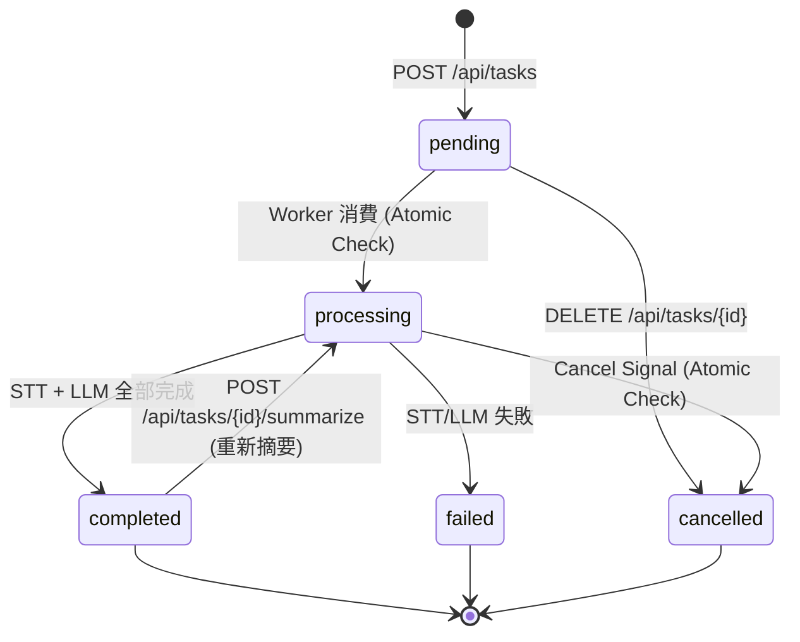
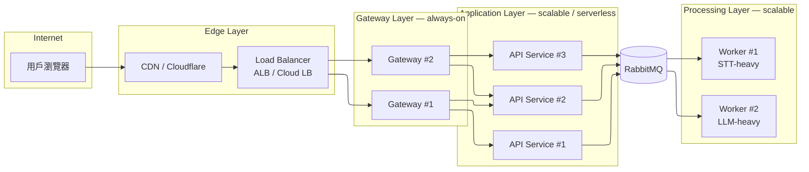

# 語音轉錄摘要系統：架構與流程圖

## Workflow 總覽

1. 用戶透過前端上傳音檔，請求進入 Gateway
2. Gateway 核發或讀取 Cookie (userId)，注入 `X-User-Id` Header，代理請求至 API Service
3. API Service 建立任務 (POST /api/tasks)，DB 寫入 pending 紀錄，返回 taskId
4. 前端攜帶 taskId 串流上傳音檔 (PUT /api/tasks/{id}/upload)，API Service 以 stream.pipeline 寫入磁碟
5. 上傳完成後 API Service 發布 STT Task 至 RabbitMQ
6. 前端連接 Gateway SSE 端點 (GET /api/tasks/{id}/events)，Gateway 訂閱 Redis Pub/Sub
7. Worker 消費 STT Task，執行音檔切片 (VAD + ffmpeg)，併發 STT 轉錄 (Semaphore = 5)
8. STT 完成，Worker 儲存 transcript 至 DB，發布 SUMMARY Task 回 RabbitMQ
9. Worker 消費 SUMMARY Task，執行 LLM 串流摘要
10. 每個 summary chunk 透過 Redis Pub/Sub 發布，Gateway 接收後即時推送 SSE 至前端
11. 摘要完成，Worker 儲存 summary 至 DB，標記 completed，發布 completed 事件
12. 用戶可隨時查詢歷史任務與結果 (GET /api/tasks, GET /api/tasks/{id})

---

## 1. 系統架構圖

---

## 2. 核心任務 Pipeline — Sequence Diagram

---

## 3. 用戶取消流程

---

## 4. 任務狀態機

---

## 5. Gateway 分層架構（雲端部署視角）

此圖展示生產環境的水平擴展策略：

- Gateway 層 always-on，透過 LB 分散 SSE 連線：不可 scale-to-zero
- API Service 層可獨立擴展或以 Serverless 部署：無狀態，可 scale-to-zero
- Worker 層可依任務類型獨立擴展：STT-heavy 與 LLM-heavy 分開調度
